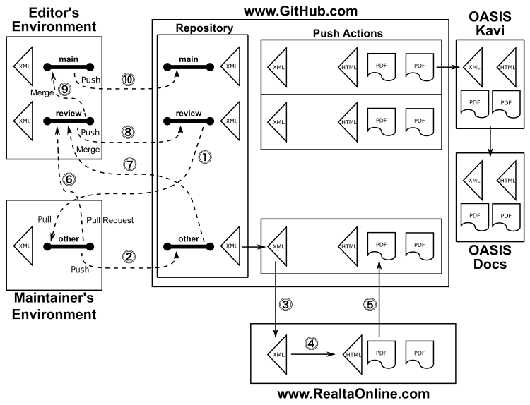
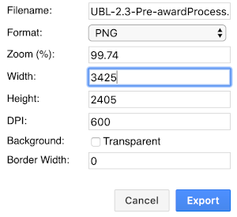

# README

<p>Members of the <a href="https://www.oasis-open.org/committees/ubl/">OASIS Universal Business Language (UBL) TC</a> create and manage technical content in this TC GitHub repository ( <a href="https://github.com/oasis-tcs/ubl">https://github.com/oasis-tcs/ubl</a> ) as part of the TC's chartered work (<i>i.e.</i>, the program of work and deliverables described in its <a href="https://www.oasis-open.org/committees/ubl/charter.php">charter</a>).</p>

<p>OASIS TC GitHub repositories, as described in <a href="https://www.oasis-open.org/resources/tcadmin/github-repositories-for-oasis-tc-members-chartered-work">GitHub Repositories for OASIS TC Members' Chartered Work</a>, are governed by the OASIS <a href="https://www.oasis-open.org/policies-guidelines/tc-process">TC Process</a>, <a href="https://www.oasis-open.org/policies-guidelines/ipr">IPR Policy</a>, and other policies, similar to TC Wikis, TC JIRA issues tracking instances, TC SVN/Subversion repositories, etc.  While they make use of public GitHub repositories, these TC GitHub repositories are distinct from <a href="https://www.oasis-open.org/resources/open-repositories">OASIS TC Open Repositories</a>, which are used for development of open source <a href="https://www.oasis-open.org/resources/open-repositories/licenses">licensed</a> content.</p>

## Table of contents

[//]: # ( view source to find readme-toc.entries )

[Description](#description) - the purpose of this repository

[Published results](#published-results) - finding the official published results (hint: not in GitHub!)

[Branches, roles, and protocol for contributions](#branches-roles-and-protocol-for-contributions) - where, who, how: overview

[Detailed steps](#detailed-steps) - where, who, how: detail

[Creating a new release](#creating-a-new-release) - getting started

  [Setup for technical committee work products](#setup-for-technical-committee-work-products) - for editors

  [Setup for subcommittee work products](#setup-for-subcommittee-work-products) - for subcommittee chairs

  [Setup for other maintainer](#setup-for-other-maintainer) - for other maintainers

  [Configuring the artefacts](#configuring-the-artefacts) - preparing artefacts

  [Configuring the hub document](#configuring-the-hub-document) - preparing documentation

[Preview results](#preview-results) - reviewing documentation

[Producing results](#producing-results) - working day-to-day

[Results](#results) - what to look for after you have committed/pushed

[Housekeeping](#housekeeping) - important cleanup

[To do:](#to-do) - shouldn't be long

[Contributions](#contributions)

[Licensing](#licensing)

[Contact](#contact)

## Description

<p>The purpose of this repository is to support committee-member collaborative activity in developing releases of the UBL committee's flagship work product, the UBL OASIS Standard.  The initial Maintainer is <a href="mailto:gkholman@CraneSoftwrights.com">G. Ken Holman</a> (GitHub: <a href="https://github.com/gkholman">gkholman</a>) of <a href="http://www.cranesoftwrights.com/">Crane Softwrights Ltd.</a>. Until further notice, questions regarding this repository may be directed to Ken.</p>

<p>The Universal Business Language (UBL) is an open library of standard electronic XML business documents for procurement and transportation such as purchase orders, invoices, transport logistics and waybills.</p>

<p>UBL defines "a generic XML interchange format for business documents that can be restricted or extended to meet the requirements of particular industries. Specifically, UBL provides the following:</p>
<ul>
<li>A suite of structured business objects and their associated semantics expressed as reusable data components and common business documents</li>
<li>A library of XML schemas for reusable data components such as "Address", "Item", and "Payment" &mdash; the common data elements of everyday business documents</li>
<li>A set of XML schemas for common business documents such as "Order", "Despatch Advice", and "Invoice" that are constructed from the UBL library components and can be used in generic procurement and transportation contexts..."</li>
</ul>

## Published results

The published results are not stored in the GitHub repository, _per se_.

See the GitHub [Actions tab](https://github.com/oasis-tcs/ubl/actions) for the results of publishing processes and distribution packaging, being careful to note the branch indicated for the desired commit message. As branches are merged the commit message is inherited in the merged branch.

You must be signed in to GitHub in order to download the results from the "Artifacts" section on the action's build result page. If not, you will get a "404 Not Found" error for the build result page.

Each downloaded result is doubly-zipped: the outer zip for GitHub extraction purposes and the inner zips for posting to Kavi and distribution. 

These files are archived by editors and subcommittee chairs, as needed, in the [committee Kavi documentation (members only)](https://www.oasis-open.org/apps/org/workgroup/ubl/documents.php) [(Public access)](https://www.oasis-open.org/committees/documents.php?num_per_wg=1000&wg_abbrev=ubl&sort_field=d1.submission_date&sort_type=DESC) repositories. The results should then be deleted from the Actions tab to save space.

The results in the [Actions tab](https://github.com/oasis-tcs/ubl/actions) eventually are deleted automatically by GitHub after 90 days, but if you have no need for a particular build result, you can delete it to save space. Please keep this in mind if you are using the GitHub web interface and creating results for every commit of every file.

## Branches, roles, and protocol for contributions

Three branches are restricted (by policy, not all by software so please be careful):

- `main` - this is content that has been reviewed by committee members and considered acceptable to be backed up on Kavi and, if necessary, distributed for its intended purpose (which may be for testing or for production use, not necessarily for final use)
- `review` - this is content from the editor that has not been reviewed by committee members yet, and so is not considered agreed-upon for its intended purpose, but the editor has incorporated input from other sources into a package for review; when there is consensus about the content of the `review` branch, it is snapshot in the `main` branch
- `ubl-version-stage` - (e.g. `ubl-2.3-csd05`) this is content the editor is working on while the `review` branch is being reviewed by committee members; this is not to be considered final and may be in a state of disrepair while it is being worked on; when the editor is ready for the committee to review it, it will be checked into the review branch

A `main` copy is not necessarily the final copy, but simply a copy of a `review` copy whose review has been completed.

Two roles are identified.

- _Editors_ are responsible for incorporating into review copies (for committee consideration) and main copies (already accepted by the committee) the suggestions made by the maintainers. 

- _Maintainers_ create and maintain their own branches and are asked not to check in any changes to the `main`, `review`, or `ubl-version-stage` branches reserved for editors. 

Maintainers can create and delete any number of their own branches as they see fit. Maintainers are reminded to pull the active `review` changes frequently so as not to diverge far from the work already progressed by the editor. Contributions are requested to be submitted by pull requests against the current `review` branch to be incorporated by the editor.

Maintainers can use any XML editing tool to make their changes to the specification document. See "[Preview results](#Preview-results)" below regarding how they can preview their XML edits locally.

Other files and directories can change however needed by the maintainer.

Become a maintainer by sending your GitHub account name and associated email address to the committee chair(s) requesting that OASIS TC Admin grant you the required privileges in the repository.


## Detailed steps

This details the relationship between the `main`, `review`, and all other branches, and the roles responsible for them.

Maintainers focus on steps 1, 2, 5, and 6. Editors focus on steps 7, 8, 9, and 10. Steps 3 and 4 are automated by GitHub Actions.



1. The maintainer creates their own personal `other` branch of their own naming, not overlapping with the name used by any other maintainer or editor, and always pulls from the `review` branch into it.
Pulling from the `review` branch must be done after every time the editor updates the `review` branch.
1. The maintainer makes the changes they wish to their local copy of the `other` branch. A local preview facility allows the maintainer to preview in a web browser their edits to the specification fully formatted as an OASIS specification.
When completed they commit their changes and push their changes to GitHub in their private branch.
1. Every push to GitHub triggers a GitHub Action that forwards a copy of the XML to the https://www.RealtaOnline.com API entry point specific to the desired outputs.
1. Réalta prepares the HTML and PDF outputs for the OASIS layout and the PDF output for the ISO Directives Part 2 layout.
1. Réalta returns to GitHub the published results in a ZIP file. The Action’s script unzips the results and packages them in a doubly-zipped ZIP file. The outer ZIP is used to wrap the Action’s artifacts results. The inner two ZIP files wrap for posting to the OASIS Kavi server, respectively, the work product inputs and intermediate files for archive purposes, and the set of work product files to be posted by TC Administration to the OASIS Docs server. These Action results are transient and not placed into the GitHub code repository. Eventually GitHub deletes old Action results. The maintainer downloads the GitHub Action’s artifacts ZIP file for their review and, if desired, local backup. If they wish to make changes, they return to step 2 and repeat the process.
1. When the maintainer is satisfied with their work to be reviewed by the editor and other team members, they send a pull request to the editor describing their changes that they have committed to their `other` branch.
1. The editor reviews the pull request and, if satisfied with the contribution, they pull the server’s copy of the `other` branch into their local environment and merge it into their local `UBL-{version}-{stage}` branch or directly into their local `review` branch.
Typically the editor will continue to make any changes they wish in their local `UBL-{version}-{stage}` branch, pushing their intermediate work to review their progress.
1. When the editor has incorporated changes from all of the contributing maintainers and is prepared to make the review document available, they merge their local `UBL-{version}-{stage}` branch into their local `review` branch and push their `review` branch to GitHub.
This push automatically triggers the GitHub Action running the complete publishing process that returns the work product ready for the editor to download from GitHub to review. The GitHub Action results are posted to Kavi for the committee and public to download the published results and review. The artifacts ZIP is manually unpacked revealing the two inner ZIPs that are then uploaded to the OASIS Kavi server for posterity and to fulfill the obligation to the public that intermediate work products be easily available. Following the OASIS TC Process the committee can qualify a snapshot on the OASIS Kavi server to be uploaded by OASIS TC Administration to the OASIS Docs server. If maintainers wish to make changes they return to step 1 (not step 2) and repeat the process. 
1. When the editor has accommodated all of the feedback from committee members regarding the review and wishes to archive a snapshot for public use, they merge their local `review` branch into their local `main` branch.
1. The editor pushes their local `main` branch to GitHub. While this push will produce a set of artefacts, those artefacts are ignored and deleted by the editor because they may have different timestamps than the files approved by committee and uploaded to Kavi. But anyone wanting a snapshot of the source material (modulo remotely changed files such as spreadsheets) can find the last approved set from the `main` branch.

If you are changing the Google spreadsheet but not any of your repository files, you cannot do a `git push` until you create a temporary file in your directory and then push the temporary file to the repository. The next time around, you can delete the temporary file in your directory and then push the deletion to the repository. Either of these steps will trigger GitHub actions that will reach out to the Google spreadsheet and run the process.

Two examples of the use of temporary files in a shell script are:
- `touch trigger.txt` - creates the temporary file
- `rm trigger.txt` - deletes the temporary file

Two examples of the use of temporary files in a DOS script are:
- `echo >trigger.txt` - creates the temporary file
- `del trigger.txt` - deletes the temporary file

## Creating a new release

The [`build.sh`](build.sh) invocation points to the particular set of parameters to use to create the artefacts. The editors maintain this file for the technical committee version of the UBL package. Alternative configurations for subcommittees can be created in subcommittee branches of this repository. As is true for other maintainers, subcommittee changes are submitted as a pull request to `review`. The subcommittee's `build.sh` is not used by the technical committee.

Whether you are creating a new committee version (e.g. UBL-2.4) or a new subcommittee version (e.g. UBL-2.4-TSC) you will need to create new document model spreadsheets: e.g. UBL-2.4 from final UBL-2.3, and UBL-2.4-TSC from current UBL-2.4. The document models are downloaded directly from Google during the GitHub Action. Each document is referenced in the invocation script as follows:

`libGoogle=https://docs.google.com/spreadsheets/d/1bWAhvsb8..library.spreadsheet..iCMLhgUrHFzY`
- the URL of your Google spreadsheet for the common library (be sure not to include the "`/edit...`" at the end of the browser bar)

`docGoogle=https://docs.google.com/spreadsheets/d/1P-3yEI0..documents.spreadsheet..0NTmINxksPQ`
- the URL of your Google spreadsheet for the documents (be sure not to include the "`/edit...`" at the end of the browser bar)

`sigGoogle=https://docs.google.com/spreadsheets/d/1bWAhvsb8..signature.spreadsheet..hgUrHoiCML`
- the URL of your Google spreadsheet for the common library (be sure not to include the "`/edit...`" at the end of the browser bar)

### Setup for technical committee work products

Starting work on a new stage or a new version involves creating a new branch off of the stage or version last developed. Once the branch is created, first modify [`build.sh`](build.sh) as required.

Consider this example of UBL 2.3 CSD05 that follows stage UBL 2.3 CS01 and version UBL 2.2:

```
export title="UBL 2.3"
export package=UBL-2.3
export UBLversion=2.3
export UBLstage=csd05
export UBLprevStageVersion=2.3
export UBLprevStage=cs01
export UBLprevVersion=2.2
export rawdir=raw
export includeISO=false

export libGoogle=https://docs.google.com/spreadsheets/d/1bWAhvsb8..library.spreadsheet..iCMLhgUrHFzY
export docGoogle=https://docs.google.com/spreadsheets/d/1P-3yEI0..documents.spreadsheet..0NTmINxksPQ
export sigGoogle=https://docs.google.com/spreadsheets/d/1bWAhvsb8..signature.spreadsheet..hgUrHoiCML
```

Before the process runs, the spreadsheets on Google should reflect the new stage string in the spreadsheet name. Examples:
- UBL 2.3 Library Elements Spreadsheet - CS01 master
- UBL 2.3 Document Elements Spreadsheet - CS01 master

The genericode file of the UBL vocabulary of the previously-published stage must replace that of the previous previously-published stage.
- e.g. if the stage previous to `csd05` was `cs01`, then for `cs02` replace `UBL-Entities-2.3-cs01.gc` with `UBL-Entities-2.3-csd05.gc` (the renamed `UBL-Entities-2.3.gc` file from the `csd05` release)
- do the same for the `UBL-Signature-Entities-*.gc` files

### Setup for subcommittee work products

When creating a branch reserved for your subcommittee, you will be responsible for tailoring the configuration to be distinct from the technical committee work products with your own spreadsheets.

Consider an example for the Transportation Subcommittee might be along the lines of a proposed UBL 2.3 TSC CSD03 that follows stage UBL 2.3 CSD02 and version UBL 2.2. 

If you are proposing spreadsheet changes, you will need to copy the CSD02 technical committee spreadsheets into separate subcommittee spreadsheets and change the titles of the spreadsheets accordingly.

First create a new branch off of the stage or version last developed. Once the branch is created, the second step is to modify [`build.sh`](build.sh) as required (note how the title and package have been customized with the subcommittee abbreviation):

```
export title="UBL 2.3 TSC"
export package=UBL-2.3-TSC
export UBLversion=2.3
export UBLstage=csd03
export UBLprevStageVersion=2.3
export UBLprevStage=csd02
export UBLprevVersion=2.2
export rawdir=raw
export includeISO=false

export libGoogle=https://docs.google.com/spreadsheets/d/OKIu..library.spreadsheet..Cpp5O
export docGoogle=https://docs.google.com/spreadsheets/d/iJ5D..documents.spreadsheet..5h1tA
export sigGoogle=https://docs.google.com/spreadsheets/d/4mc6..signature.spreadsheet..OXE5T
```

Before the process runs, the spreadsheets on Google should reflect the new committee acronym in the spreadsheet name. Examples:
- UBL 2.3 TSC Library Elements Spreadsheet 
- UBL 2.3 TSC Document Elements Spreadsheet 

The other non-documentation artefacts configured by the technical committee should be sufficient to re-use as they are.

### Setup for other maintainers

If you are not working on the spreadsheets, it should be enough simply to create a new branch of your own from either the technical committee branch or one of the subcommittee branches, and re-use the configuration files as given.

However, if you have to modify the spreadsheets, you could choose to operate as if you were a one-person subcommittee and follow all of the subcommittee directions for configuration.

In fact, you could choose always to operate as if you are a one-person subcommittee and make configuration file changes to distinguish your work products from those of other maintainers. But this is not an obligation if all you have to do is submit revised text.

### Configuring the artefacts

Each revision is described by the following configuration files for the artefacts:
- target identification when converting ODS to genericode
  - [`ident-UBL.xml`]( ident-UBL.xml ) 
  - [`ident-UBL-Signature.xml`]( ident-UBL-Signature.xml )
- XSD and JSON schema configuration
  - [`config-UBL.xml`]( config-UBL.xml )
    - IMPORTANT NOTE: there is version information in a comment at the top of this configuration file that, when changed, must be manually added to comments in the eight `UBL-*.xsd` XSD schema fragments found in the directory [`raw/xsd/common`]( raw/xsd/common )
    - `  Library:           OASIS Universal Business Language (UBL) 2.x *STAGE-UPPER-CASE*`
    - `                     http://docs.oasis-open.org/ubl/*stage-lower-case*-UBL-2.x/`
    - `  Release Date:      *DATE*`
  - [`config-UBL-Signature.xml`]( config-UBL-Signature.xml )
    - IMPORTANT NOTE: this file has the same version information as found in `config-UBL.xml` that needs to be updated as required
- Google bug-avoidance model name massage directives
  - [`massageModelName.xml`]( massageModelName.xml )
- CVA master file for code list second-pass validation
  - [`UBL-CVA-Skeleton.cva`]( UBL-CVA-Skeleton.cva )
- shell wrapper for generated CVA Schematron pattern
  - [`UBL-DefaultDTQ-shell.sch`]( UBL-DefaultDTQ-shell.sch )
- spell-check word list (each line is a word not in the dictionary that is allowed to be in UBL, including misspellings from previous versions of UBL that cannot be repaired due to backward compatibility)
  - [`spellcheck-UBL.txt`]( spellcheck-UBL.txt )
- documentary ODS template skeleton for generating spreadsheet results
  - [`skeletonDisplayEditSubset.ods`]( skeletonDisplayEditSubset.ods )

### Configuring the hub document

All references in the hub document `UBL.xml` to version, revision, and date information must be maintained in a set of general entities maintained in the internal document type subset along the lines of the following for CSD05 that followed CS01:

```
	<!ENTITY name "UBL">
	<!ENTITY pversion "2.2">
	<!ENTITY version  "2.3">
	<!ENTITY pstage   "cs01">
	<!ENTITY PSTAGE   "CS01">
	<!ENTITY stage    "csd05">
	<!ENTITY STAGE    "CSD05">
	<!ENTITY isostage "WD">
	<!ENTITY standard "Committee Specification Draft 05">
	<!ENTITY stagetext "Committee Specification Draft 05">
	<!ENTITY standard "Committee Specification 01xxxxxx">
	<!ENTITY stagetext "Committee Specification 01xxxxxx">
	<!ENTITY standard "Committee Specification Draft 04 / Working Draft 03xxxxx">
	<!ENTITY stagetext "Committee Specification Draft 04 Working Draft 03xxxxx">
	<!ENTITY this-loc "https://docs.oasis-open.org/ubl/&stage;-UBL-2.3">
	<!ENTITY previous-loc "https://docs.oasis-open.org/ubl/&pstage;-UBL-2.3">
	<!ENTITY latest-loc "https://docs.oasis-open.org/ubl">
	<!ENTITY pubdate "12 May 2021">
	<!--remove time from pub date-->
	<!ENTITY pubyear "2021">
	<!ENTITY pubdate-iso "ccyy-mm-dd">
	<!ENTITY reldate-iso "ccyy-mm">
```

Recall that only the first declaration of a given general entity is respected. This allows prototypical declarations to be maintained after the active declaration is specified in the file.

There are a number of SYSTEM general entities whose content is not edited by hand. Rather, they are generated from the inputs of other configuration files `UBL-Party-summary-information.xml` and `UBL-Schema-summary-information.xml` that are the responsibility of the maintainer to make consistent with their expectations of the hub document.

Source files, processing stylesheets, and resulting entities generated or used in the building of the hub document - EDIT THE XML FILES ONLY DO NOT EDIT THE ENTITIES (`-ent.xml`) DIRECTLY AS YOUR EDITS WILL BE IGNORED:
- [`UBL.xml`](UBL.xml) is the raw main hub document that gets massaged, assembled, and processed in the final `UBL-{version}.xml`
- [`UBL-Party-summary-information.xml`](UBL-Party-summary-information.xml) processed by `partydoc2db.xsl`:
  - `summary-parties-ent.xml`
- [`UBL-Schema-summary-information.xml`](UBL-Schema-summary-information.xml) processed by `schemadoc2db.xsl`:
  - `summary-namespaces-ent.xml`
  - `summary-schemas-ent.xml`
  - `summary-examples-ent.xml`
- `UBL-{prevVersion}.xml` is the final monolithic hub document from the previous version of UBL; this is processed by `hub2processSummary.xsl`:
  - `summary-processes-ent.xml`
- the artefacts building process creates the following four entity files for comparing current versions to old versions:
  - `old2newDoc-from-previous-version-documents-ent.xml` 
  - `old2newDoc-from-previous-version-library-ent.xml`   
  - `old2newDoc-from-previous-stage-documents-ent.xml`   
  - `old2newDoc-from-previous-stage-library-ent.xml`

The `old2newDoc` version entities are always in play in the hub document, through to the completion of OASIS Standard. As the work proceeds in stages during working drafts and committee specification drafts, the `old2newDoc` stage entities are incorporated into the appendix comparing the previous stage to the current stage. Once the model has been completed and the work is progressing through Committee Specification to OASIS Standard, that stage-perspective section of the documentation is commented out and not included.

Please note the documentation above regarding `ATTENTION-new-entities.txt` and how to remove that file from the build process by replacing the authoring environment "old" entities with the build environment "new" entities.

Subdirectories:
- [`images`]( images ) - original revisable source vector artwork in `.svg` or `.drawio` (incomplete set of files because many originals have been lost; please add originals here using same base name as published)
- [`art`]( art ) - high-res PNG artwork for print publishing (max width: 5.7in/14.5cm)
  - at a resolution of 600dpi: max width: 3425 pixels
  - at a resolution of 400dpi: max width: 2283 pixels
  - at a resolution of 300dpi (minimum): max width: 1713 pixels
- [`htmlart`]( htmlart ) - low-res PNG artwork for web publishing (max width: 750 pixels)
- [`os-UBL-2.0`]( os-UBL-2.0 ) - code list subdirectory copied from released version of UBL 2.0
- [`os-UBL-2.1`]( os-UBL-2.1 ) - code list subdirectory copied from released version of UBL 2.1
- [`os-UBL-2.2`]( os-UBL-2.2 ) - code list subdirectory copied from released version of UBL 2.2
- [`os-UBL-2.3`]( os-UBL-2.3 ) - code list subdirectory copied from released version of UBL 2.3
- [`raw`]( raw ) - pre-populated content of the results directory with skeleton contents
  - [`raw/cl`]( raw/cl ) - code list content from having run the code list tooling and results here:
    - https://www.oasis-open.org/committees/document.php?document_id=67039 - tooling
    - https://www.oasis-open.org/committees/document.php?document_id=67038 - results
    - the `master-code-list-UBL-*.xml` file records the input information to the code list generation 
  - [`raw/json`]( raw/json ) - sample JSON instances converted from the sample XML instances
  - [`raw/json-schema`]( raw/json-schema ) - hand-authored JSON Schema fragments
  - [`raw/mod`]( raw/mod ) - hand-authored model documentation fragments
  - [`raw/val`]( raw/val ) - demonstration validation environment and validation of the XML samples
  - [`raw/xml`]( raw/xml ) - sample XML instances
  - [`raw/xsd`]( raw/xsd ) - hand-authored XML Schema fragments
- [`utilities`]( utilities ) - tools used to generate outputs

Image creation using the [`http://draw.io`](http://draw.io) tool:
- copy [`UBL-2.3-Pre-awardProcess.drawio`](images/UBL-2.3-Pre-awardProcess.drawio ) as a starting point full-width image with your own file name
- open the copy in [`http://draw.io`](http://draw.io) and modify it as required
- save the vector file in the [`images`]( images ) directory
- using the menu item File / Export as / Advanced...
  - select PNG format
  - set the DPI to 600 using "Custom"
  - set the width of the image to a maximum 3425 pixels
    - the zoom should be less than or equal to 100%
    - of course if the image is not the full width of the page the width count can be less to proportionally less than 3425
  - turn off the transparent background and any border width
  - 
  - save the resulting high-res PNG file into the [`art`]( art ) directory
  - copy the high-res PNG file into the [`htmlart`]( htmlart ) directory
  - using [ GIMP ]( https://www.gimp.org/ ) or some other pixel image manipulation tool, scale the [`htmlart`]( htmlart ) copy to be a maximum of 750 pixels (or proportionally smaller) and 96 DPI

### Preview results

Intermediate edits saved to the local `UBL.xml` file can be previewed instantly in a browser on your computer. It is recommended that one do this to establish their edits are satisfactory before checking in to GitHub to trigger the published results. The preview does not regenerate the SYSTEM general entities, so it may be necessary to push your intermediate work to your branch in order to obtain replacement entity files for your repository from the published results.

Note that the preview HTML presents the high-resolution PDF images, not the low-resolution HTML images and so the images are dramatically oversized in the browser window. This is not the case for the published HTML returned from GitHub.

Once the XML has been opened in the browser, it is necessary only to refresh the browser window after each save of the XML edits. It is not necessary to go through again the drag-and-drop or open requests.

Opening the XML in Windows:
- drag and drop the XML source onto Internet Explorer, or "right-click, Open with..., Internet Explorer"
- use Ctrl-R or F5 to refresh the browser after editing the file
- this does not work with Firefox, Chrome, or Edge browsers

Opening the XML in Mac OSX:
- drag and drop the XML source onto Safari, or "right-click, Open With, Safari"
- use Cmd-R to refresh the browser after editing the file
- this does not work with Firefox or Chrome browsers

## Producing results

If you are working from the GitHub web interface, every time you commit a change you will trigger a `git push`. If you are working from the command line you can do multiple commits before you push them to the repository.

Every `git push` to the repository triggers the GitHub Action execution of the build process on the files found in the repository after the push. The action takes about 25 minutes of processing on GitHub to create all of the artefacts. The resulting ZIP is about 160Mb and when unzipped provides the two archive and distribution ZIP files with the results.

The results that are to be made public are posted as-is to Kavi. Please do not make reference to the GitHub artefacts in committee mail list posts as those artefacts evaporate after 90 days.

When needed, OASIS TC Administration posts the distribution package from Kavi to the https://docs.oasis-open.org/ubl OASIS web site.

## Results

The build result (after about 30 minutes on the [GitHub Actions tab](https://github.com/oasis-tcs/ubl/actions)) in the target directory:
- `UBL-package-github-{timestamp}.zip` - download package

The embedded ZIP files found in the download package:
- `UBL-2.x-{stage}-{timestamp}.zip` - distribution artefacts
- `UBL-2.x-{stage}-{timestamp}-archive-only.zip` - archive artefacts

To determine if the files are ready for sending to the project editors, look in the results in the `archive-only` ZIP for these files summarizing any problems with the submission:
- `build.exitcode.{timestamp}.txt` - exit code from the execution of the Ant build script
- `build.console.{timestamp}.txt` - console log of the execution of the Ant build script
- `check-ubl-version-stage-ubl-version-pstage.html` - e.g. `check-ubl-2.3-csd05-ubl-2.3-cs01.html` - report of differences between the current version/stage and the previous version/stage
- `check-ubl-version-stage-ubl-peversion.html` - e.g. `check-ubl-2.3-csd05-ubl-2.2` - report of differences between the current version/stage and the previous version.

IMPORTANT: If there is no console log file, then the build script failed in an unexpected fashion. Details may be found in the action tab's workflow log.

There should be no "`.txt`" files in the returned base directory. Various "`.txt`" files are possible to report problems with the build. The problems should be explained in the file itself or correlated in the `build.console.{timestamp}.txt` file:
 - `ATTENTION-new-entities.txt` indicates that in the `archive-only/` subdirectory has a `new-entities/` directory with new entity files that were created by your changes to the document, schema summary, and party XML files; if there are any new entity files, you must replace your local copies with those new entities in order for the validation in your XML editor to match the validation results on the server; if the `new-entities` directory does not exist, then there is no need to update your local entity files.
 - `INTEGRITY-PROBLEMS.txt` - there are files referenced in the hub document that do not exist, or there are files that exist and are not referenced in the hub document
 - `LIST-OF-PROBLEM-CODE-LISTS.txt` - genericode files in the `cl/` directory that are not genericode-schema valid
 - `MISMATCHED-TEST-SAMPLES-SH-WARNING.txt` - the number of invocations in the `val/testsamples.sh` script does not match the number of examples
 - `MISMATCHED-TEST-SAMPLES-BAT-WARNING.txt` - the number of invocations in the `val/testsamples.bat` script does not match the number of examples
 - `NDR-SPELL-CHECK-WARNING.txt` - see the [`unexpectedWords.txt`](unexpectedWords.txt) for a list of words that are not found in English or the UBL dictionary
 - `UNEXPECTED-SAMPLES-NS-PI-DETAILS.txt` - open the file to see a list of unexpected namespace declarations found in sample files
 - `UNEXPECTED-TEST-RESULT-WARNING.txt` - the `val/test.sh` script did not end cleanly
 - `UNEXPECTED-TEST-SAMPLES-RESULT-WARNING.txt` - at least one invocation in the `val/testsamples.sh` did not validate 

When editors create their final edits, the results from the `git push` should be ready to be published without any modifications. If there are errant or unexpected files in the directory, the build process needs to address the discrepancies.

## Housekeeping

After having downloaded your results, please delete your entire workflow run listed in the [Actions tab](https://github.com/oasis-tcs/ubl/actions) after you are done. This will save space and will promote the public access of the Kavi repository rather than intermediate issues.

PLEASE BE CAREFUL: ANY MEMBER CAN DELETE ANY WORKFLOW SO TRY HARD NOT TO DELETE THE WORKFLOW CREATED BY A COLLEAGUE; CHECK THE BRANCH NAMES.

### To do:

- the 2.4 code list files in the `raw/` directory for now simply are the 2.3 code list files renamed as 2.4

---
<h3>Contributions</h3>
<p>As stated in this repository's <a href="https://github.com/oasis-tcs/ubl/blob/main/CONTRIBUTING.md">CONTRIBUTING file</a>, contributors to this repository are expected to be Members of the OASIS UBL TC, for any substantive change requests.  Anyone wishing to contribute to this GitHub project and <a href="https://www.oasis-open.org/join/participation-instructions">participate</a> in the TC's technical activity is invited to join as an OASIS TC Member.  Public feedback is also accepted, subject to the terms of the <a href="https://www.oasis-open.org/policies-guidelines/ipr#appendixa">OASIS Feedback License</a>.</p>

<h3>Licensing</h3>
<p>Please see the <a href="https://github.com/oasis-tcs/ubl/blob/main/LICENSE.md">LICENSE</a> file for description of the license terms and OASIS policies applicable to the TC's work in this GitHub project. Content in this repository is intended to be part of the UBL TC's permanent record of activity, visible and freely available for all to use, subject to applicable OASIS policies, as presented in the repository <a href="https://github.com/oasis-tcs/ubl/blob/main/LICENSE.md">LICENSE</a> file.</p>

<h3>Contact</h3>
<p>Please send questions or comments about <a href="https://www.oasis-open.org/resources/tcadmin/github-repositories-for-oasis-tc-members-chartered-work">OASIS TC GitHub repositories</a> to  <a href="mailto:chet.ensign@oasis-open.org">Chet Ensign</a>.  For questions about content in this repository, please contact the TC Chair or Co-Chairs as listed on the the UBL TC's <a href="https://www.oasis-open.org/committees/ubl/">home page</a>.</p>
